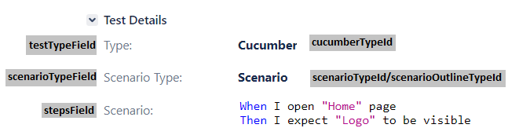

[](https://badge.fury.io/js/xray-formatter)

# xray-formatter

This is an Xray formatter for Cucumber automation framework. Use this formatter if you
use [Xray Jira plugin](https://www.getxray.app/test-management) for managing your automation test cases and running them
via [Xray Test Executions](https://docs.getxray.app/display/XRAY620/Test+Execution).

1. [Installation](#installation)
2. [Usage](#usage)
	- [Save results in a file](#save-results-in-a-file)
	- [Send results to Jira](#send-results-to-jira)
	- [Options](#options)
3. [CLI commands](#cli-commands)
	- [xray-upload](#xray-upload)
	- [xray-clear](#xray-clear)
	- [xray-extract](#xray-extract)
	- [xray-import](#xray-import)

## Installation

To install the package, run:

```shell
npm install xray-formatter
```

Add the reporter configuration to your Cucumber config file.

## Usage

For this reporter to work correctly, Cucumber tests need to have their unique Jira IDs saved in the tags. If the test
has several Jira tags, only the first one will be used to save the result.

```gherkin
Feature: Feature

  @PC-12345
  Scenario: Some Test
```

### Save results in a file

By default, only `regexp` and `report` options needs to be provided. The regular expression needs to match the Jira tags
and return the ID as the first capturing group.

The results of the test run will be saved in a file, which can be manually imported in a Xray Test Execution (
see [docs](https://docs.getxray.app/display/XRAY620/Import+Execution+Results)).

```javascript
module.exports = {
	default: {
		format: [
			'xray-formatter:reports/xray.json',
		],
		formatOptions: {
			jiraOptions: {
				regexp: /(PC-\d+)/,
				report: './reports/xray.json'
			}
		}
	}
}
```

### Send results to Jira

If you want to send the results to Xray Test Execution automatically, you need to provide `endpoint`, `token`
and `execution` options.

```javascript
module.exports = {
	default: {
		format: [
			'xray-formatter:reports/xray.json',
		],
		formatOptions: {
			jiraOptions: {
				endpoint: 'https://jira.company.com/jira/',
				token: '123456789',
				execution: 'PC-7',
				regexp: /(PC-\d+)/,
				report: './reports/xray.json',
			}
		}
	}
}
```

The results will be updated in real time.

### Note

- This formatter uses default Xray test statuses: 'TODO', 'PASS' and 'FAIL'.
- In order to avoid reporting false positive results for Scenario Outlines, the formatter will not change any test's
	status from 'FAIL' to 'PASS'. If you need to rerun tests from an execution, set them in 'TODO' status manually or
	provide `resetTests` option in the config.

## Options

| Name       | Type     | Example                            | Description                                                                                                           | Optional |
|------------|----------|------------------------------------|-----------------------------------------------------------------------------------------------------------------------|----------|
| regexp     | RegExp   | /@jira\\((\w+-\d+)\\)/             | Regular expression for getting a test's Jira ID from its tags. The first capturing group should return the ID.        | No       |
| report     | string   | ./report/xray.json                 | Path to the file where the xray report will be saved.                                                                 | No       |
| endpoint   | string   | [https://jira.company.com/jira/]() | Your Jira endpoint.                                                                                                   | Yes      |
| token      | string   |                                    | Jira API token. See [docs](https://confluence.atlassian.com/enterprise/using-personal-access-tokens-1026032365.html). | Yes      |
| execution  | string   | PC-7                               | The ID of your Xray Test Execution.                                                                                   | Yes      |    
| resetTests | string[] | ['PC-1', 'PC-2', 'PC-3']           | An array of tests which should be reset in 'TODO' status before the run.                                              | Yes      |
| pageLimit  | number   | 100                                | Max number of items returned by Xray API. Default is 200, set to another number if you have custom settings.          | Yes      |

## CLI commands

Before running CLI commands, create a configuration file with your Jira endpoint and an access token.

By default, the package will search for ```xray.config.json``` in your root directory. To set a custom path, pass it in
your command as a ```--config``` argument.

Example of a basic ```xray.config.json``` file:

```json
{
  "endpoint": "https://jira.company.com/jira/",
  "token": "12345"
}
```

### xray-upload

```shell
xray-upload --execution PC-1 --path ./report/xray.json
```

This command uploads test results from a JSON Xray report to the Xray execution.

**Options:**

1. ```execution``` - ID of your Test Execution.
2. ```path``` - path to your xray report.

### xray-clear

```shell
xray-clear --execution PC-1
```

This command sets all tests in the execution in TODO status.

**Options:**

1. ```execution``` - ID of your Test Execution.

### xray-extract

```shell
xray-extract --execution PC-1
xray-extract --report ./report/xray.json
```

This command extracts IDs of failed/unexecuted tests from a Text Execution or an xray report file, and saves them as a
Cucumber tag string. The string can be used to re-run those tests.

By default, the tags are saved in a ```@id1 or @id2 or @id3``` format. If you use a different format to mark your tests
with their Jira IDs, you can provide a ```--format``` option.

```shell
xray-extract --execution PC-1 --format "@jira(id)"
```

**Options:**

1. ```execution``` - ID of your Test Execution.
2. ```report``` - path to your xray report.
3. ```format``` - format for saving the tags.
4. ```path``` - path to a file where the tag string will be saved. Default: ```./tags.txt```

### xray-import

```shell
xray-import --path ./features/ --regexp "(PC-\\d+)"
```

This command parses .feature files and updates steps in Jira scenarios with a corresponding ID.

To use this command, you need to add ```customFields``` property to your xray config. 
This property should contain custom field IDs for test type, scenario type and steps; as well as value IDs for "Cucumber" test type and "Scenario"/"Scenario Outline" scenario types.



These fields and values are unique for every Jira instance, and you can look them up in Xray configuration or by inspecting elements on the page.

```json
{
  "endpoint": "https://jira.company.com/jira/",
  "token": "12345",
  "customFields": {
    "testTypeField": "customfield_10112",
    "cucumberTypeId": "10001",
    "scenarioTypeField": "customfield_10113",
    "scenarioTypeId": "10003",
    "scenarioOutlineTypeId": "10004",
    "stepsField": "customfield_10114"
  }
}
```
